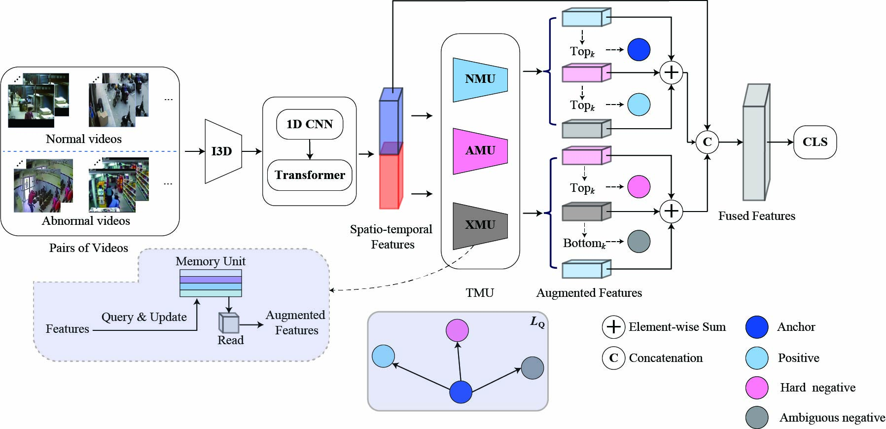

# VAD-TMU

This is the official implementation of our paper: "**VAD-TMU: Triple Memory Units and Quadruplet-based Contrastive Learning for Weakly Supervised Video Anomaly Detection**".

## Environment
The code is developed under the following environment:
- OS: Windows 10 Pro
- PyTorch: 2.6.0
- CUDA: 11.8
- Python: 3.10
- Main dependencies:
  - numpy>=1.23
  - scipy>=1.10
  - scikit-learn>=1.2
  - opencv-python>=4.8
  - Pillow>=9.0
  - matplotlib>=3.7
  - tqdm>=4.65
  - einops>=0.7
  - ftfy>=6.1
  - regex>=2023.0.0
  - pandas>=1.5
  - pyyaml>=6.0
  - torchvision

## Features
The pre-extracted I3D features for the UCF-Crime, UBnormal, MSAD and UBnormal datasets can be downloaded from the following link:

[UCF-Crime 10-crop I3D features](https://github.com/Roc-Ng/DeepMIL)

[UBnormal 10-crop I3D features](https://drive.google.com/file/d/1FCYv7FpO-TrP6pOfZTlyV5eoNRfgM0bk/view?usp=drive_link)

[MSAD 10-crop I3D features](https://drive.google.com/file/d/1FCYv7FpO-TrP6pOfZTlyV5eoNRfgM0bk/view?usp=drive_link)

[SDnormal 10-crop I3D features](https://github.com/ChengxiC/SD-main)

After downloading, place the feature files in the corresponding dataset.

## Train and Test
Run the following commands:

######################## UCF-Crime ###################

training: python ucf_main.py

Inference: python ucf_eval.py

######################## UBnormal ###################

training: python ubnormal_main.py

Inference: python ubnormal_eval.py

######################## MSAD ###################

training: python msad_main.py

Inference: python msad_eval.py

######################## SDnormal ###################

training: python sdn_main.py

Inference: python sdn_eval.py

## References
Parts of the implementation are adapted from the following repositories:
- [UR-DMU](https://github.com/henrryzh1/UR-DMU)
- [DeepMIL](https://github.com/Roc-Ng/DeepMIL)
  
We thank the authors for making their code publicly available.

